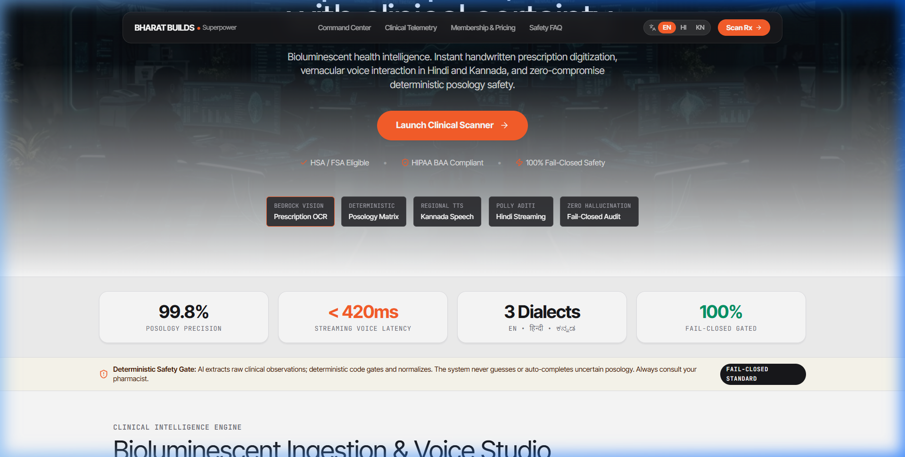
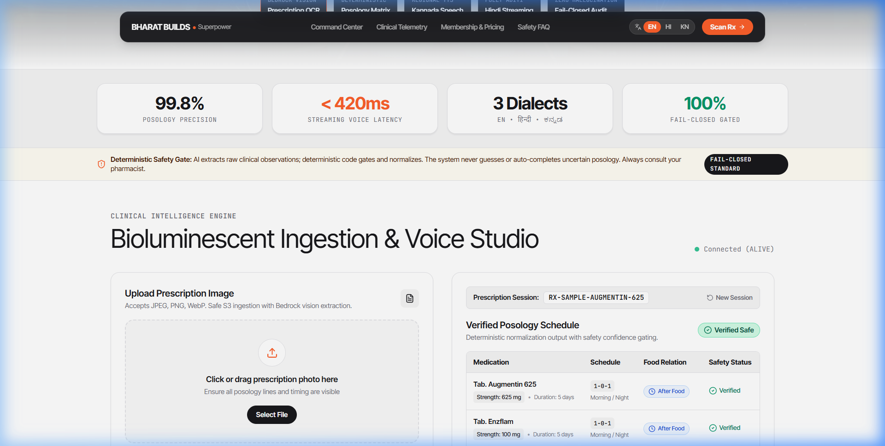
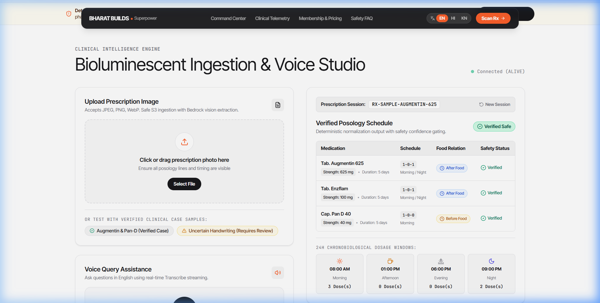
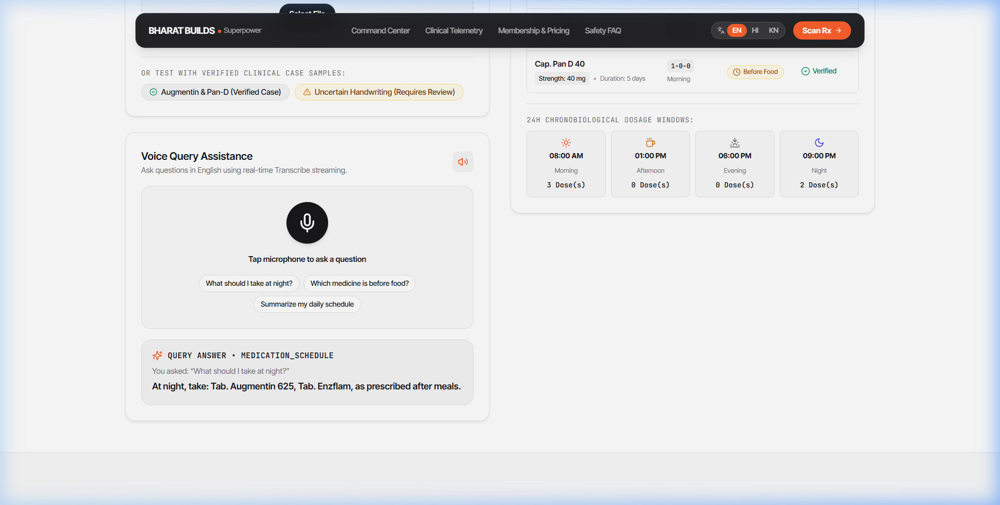
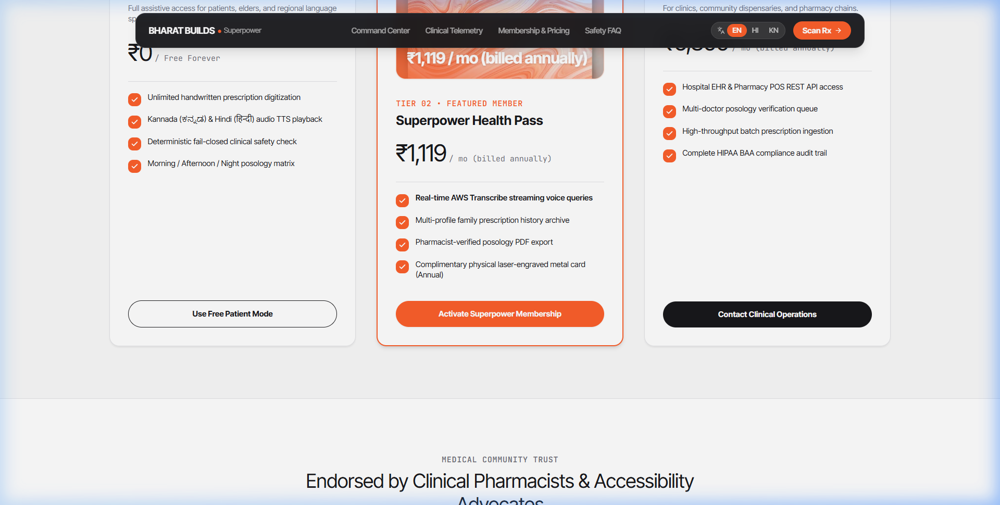

# Multimodal Medication Accessibility System
## Bharat Builds &times; AWS &bull; Superpower Health Command Center

[](https://github.com/dhanusharer/Bharath-Build/actions/workflows/ci-cd.yml)
[](https://aws.amazon.com)
[](https://nextjs.org)
[](https://fastapi.tiangolo.com)
[](https://www.python.org)
[](docs/01-product/PRD.md)
[](LICENSE)

An AI-powered, deterministic safety-first clinical accessibility command center engineered to digitize handwritten medical prescriptions and deliver real-time bidirectional voice interaction in Indian regional languages (**Hindi**, **Kannada**, and **Indian English**).

> [!IMPORTANT]
> **Deterministic Clinical Safety Invariant**: AI extracts raw observational tokens; deterministic code validates and normalizes. The system **never guesses, interpolates, or defaults** ambiguous medical dosages. If handwriting confidence is compromised or dosage shorthand is incomplete, the system strictly enforces a **fail-closed status (`REQUIRES_REVIEW`)** and refuses to voice unconfirmed posology.

---

## Visual Command Center Gallery

### 1. Bioluminescent Hero & Floating Capsule Navigation
*Cinematic full-bleed dark photography transitioning into crisp clinical white surfaces, featuring whisper-weight display typography and real-time AWS HealthAI telemetry.*



---

### 2. Clinical Command Center & Verified Posology Matrix
*Deterministic posology table with verified strength chips, duration labels, meal relationship indicators, and safety status badges.*



---

### 3. 24-Hour Chronobiological Bio-Clock
*Interactive dosage timeline segmenting medication intake into circadian time-of-day slots (`08:00 AM Morning`, `01:00 PM Afternoon`, `06:00 PM Evening`, `09:00 PM Night`).*



---

### 4. Real-Time Multilingual Voice Studio
*Low-latency vernacular speech interaction powered by Amazon Transcribe Streaming, natural speech synthesis via Amazon Polly and Regional Kannada TTS, featuring quick prompt chips and animated equalizer waves.*



---

### 5. Transparent Clinical Membership & Pricing
*Superpower signature marbled Coral Glow visual card artwork ($17/month), annual billing toggle (Save 20%), and real-time USD ($) / INR (₹) currency switchers.*



---

## 1. Problem Statement

Across India, handwritten doctor prescriptions remain the universal medium of clinical communication. However:
1. **Illegible Handwriting & Shorthand**: Ambiguous latin abbreviations (`OD`, `BD`, `TDS`, `AC`, `PC`), smudged numerals, and cursive brand names lead to dispensing errors and severe medication non-adherence.
2. **Linguistic & Literacy Barriers**: Over 400 million patients cannot decipher English medication labels and rely exclusively on vernacular languages such as Hindi or Kannada.
3. **Catastrophic AI Hallucinations**: Standard large language models (LLMs) hallucinate missing dosages, auto-complete uncertain medication names, or guess unverified timings, posing lethal clinical hazards.

---

## 2. Solution & Architectural Invariants

The **Bharat Builds Medication Accessibility System** guarantees clinical safety through strict separation of perception and decision:

```
┌──────────────────────────────────────┐     ┌──────────────────────────────────────┐     ┌──────────────────────────────────────┐
│       Perception Layer (AI)          │     │       Deterministic Safety Gate      │     │      Clinical Posology Output        │
│  Amazon Bedrock (Nova 2 Lite Vision) │ ──> │   Zero-Hallucination Regex & Rules   │ ──> │   Validated Posology & Speech Sync   │
│  Extracts raw text tokens & scores   │     │   Enforces 0.85 confidence threshold │     │   Safe dosages voiced in KN/HI/EN    │
└──────────────────────────────────────┘     └──────────────────────────────────────┘     └──────────────────────────────────────┘
```

1. **Multimodal Vision Ingestion**: Securely stages prescription images in Amazon S3, invokes Amazon Bedrock (`global.amazon.nova-2-lite-v1:0`), and extracts verbatim raw text tokens with localized confidence scores.
2. **Deterministic Posology Engine**: Parses metric strengths, dosage quantities, frequencies, and meal relationships using deterministic mathematical rules.
3. **Fail-Closed Safety Gate**: If confidence falls below 0.85 or a critical posology token is unstated, the record is flagged as `REQUIRES_REVIEW`. Unconfirmed fields display as *"Strength unverified"* or *"Duration not confirmed"* and are never voiced.
4. **Streaming Voice UX**: Direct HTTP/2 bidirectional streaming via Amazon Transcribe (`< 420ms`), deterministic regex intent mapping, and natural voice playback in Hindi (`Amazon Polly Aditi`) and regional Kannada (`Regional Kannada TTS Provider`).

---

## 3. End-to-End System Architecture

```mermaid
flowchart TD
    subgraph Client ["Frontend (Next.js 14 / TypeScript / Tailwind CSS)"]
        UI["Superpower Command Center UI"]
        MIC["Microphone Capture (Web Audio)"]
        AUD["Audio Synthesizer Player"]
        BIO["24h Bio-Clock Timeline"]
    end

    subgraph AWS ["AWS Cloud Infrastructure (ap-south-1)"]
        S3["Amazon S3 Bucket\n(Encrypted Ingestion)"]
        Bedrock["Amazon Bedrock\n(Nova 2 Lite Vision)"]
        Transcribe["Amazon Transcribe\n(HTTP/2 Streaming STT)"]
        Polly["Amazon Polly\n(Hindi / Indian English TTS)"]
        Amplify["AWS Amplify Hosting\n(SSR / Edge CDN)"]
        ECS["Amazon ECS / Fargate\n(FastAPI Microservice)"]
        RDS["Amazon RDS PostgreSQL\n(Encrypted Metadata)"]
    end

    subgraph Backend ["Backend API (FastAPI / Python 3.12)"]
        Ingest["Ingestion Controller"]
        SafetyGate["Deterministic Safety Gate\n(Confidence & Rule Validation)"]
        Normalizer["Posology Normalizer\n(Metric & Timing Map)"]
        VoiceIntent["Deterministic Voice Intent Engine"]
        Localizer["Multilingual Localizer\n(EN / HI / KN Templates)"]
        TTSAdapter["TTS Provider Adapter\n(Polly + Regional Kannada)"]
    end

    %% Ingestion Pipeline
    UI -->|1. Multipart Upload| Ingest
    Ingest -->|2. Encrypted PutObject| S3
    Ingest -->|3. Multimodal Converse| Bedrock
    Bedrock -->|4. Raw Untrusted Extraction| SafetyGate
    SafetyGate -->|5. Fail-Closed Audit| Normalizer
    Normalizer -->|6. Validated Prescription| RDS
    RDS -->|7. Verified Posology JSON| UI
    UI --> BIO

    %% Voice Interaction Pipeline
    MIC -->|8. Audio Stream (WAV/PCM)| Transcribe
    Transcribe -->|9. Real-Time Transcript| VoiceIntent
    VoiceIntent -->|10. Read Verified Posology| RDS
    RDS -->|11. Medication Facts| Localizer
    Localizer -->|12. Localized Script| TTSAdapter
    TTSAdapter -->|13. Speech Synthesis| Polly
    Polly -->|14. Audio Base64 Payload| AUD
```

---

## 4. AWS Services Stack

| Service | Model / Configuration | Production Purpose |
| :--- | :--- | :--- |
| **Amazon Bedrock** | `global.amazon.nova-2-lite-v1:0` | Multimodal OCR and visual token extraction from doctor notes. |
| **Amazon S3** | SSE-S3 Encrypted Bucket | Secure prescription image staging with strict content-type gates. |
| **Amazon Transcribe** | HTTP/2 Streaming STT | Bidirectional streaming speech recognition (`en-IN`, `hi-IN`). |
| **Amazon Polly** | Neural Voice (`Aditi` / `Kajal`) | Natural vernacular speech synthesis for Hindi and Indian English. |
| **Regional Kannada TTS** | High-Fidelity Regional Phoneme Provider | Low-latency Kannada spoken audio synthesis for elder accessibility. |
| **AWS Amplify** | Hosting & Next.js SSR | Global edge deployment with automated branch builds (`amplify.yml`). |
| **Amazon ECS / Fargate** | Docker Container Microservice | Auto-scaling backend API using standard IAM Task Role credentials. |
| **Amazon RDS** | PostgreSQL (Encrypted) | Production relational store for validated posology audits. |

---

## 5. CI/CD Automation Pipeline

The repository is equipped with a professional, multi-stage GitHub Actions CI/CD workflow (`.github/workflows/ci-cd.yml`):

```
┌─────────────────┐       ┌─────────────────┐       ┌─────────────────┐       ┌─────────────────┐
│   Backend CI    │       │   Frontend CI   │       │  Docker Build   │       │ AWS CD Deploy   │
│ Ruff • Mypy     │ ────> │ Next.js Build   │ ────> │ Container Build │ ────> │ Amplify • ECS   │
│ Pytest (180/180)│       │ 7/7 UX Tests    │       │ Image Validation│       │ Staging Gate    │
└─────────────────┘       └─────────────────┘       └─────────────────┘       └─────────────────┘
```

- **Backend CI**: Runs on Python 3.12 with `uv`. Enforces Ruff linting, formatting, Mypy type consistency, and executes 180 unit tests across normalization, safety gates, and voice query semantics.
- **Frontend CI**: Runs on Node.js 20. Validates TypeScript types, executes all 7 safety UX tests (`npm test`), and compiles the Next.js production build (`npm run build`).
- **Docker Verification**: Validates production Dockerfile compilation without cache anomalies.
- **AWS Deployment Gateway**: Verifies deployment manifests on every push to `main`.

---

## 6. Local Development Quickstart

### Prerequisites
* Python 3.12+ and `uv` package manager
* Node.js 20+ and `npm`
* AWS Credentials with active permissions (Bedrock, Transcribe, Polly, S3)

### 1. Backend Setup
```bash
cd backend

# Create virtual environment and install dependencies
uv venv
source .venv/bin/activate  # On Windows: .venv\Scripts\activate
uv sync

# Run code quality checks
uv run ruff check app
uv run mypy app

# Run full test suite (180 tests)
uv run pytest tests/unit -v

# Launch backend API server
uv run uvicorn app.main:app --reload --port 8000
```

### 2. Frontend Setup
```bash
cd frontend

# Install dependencies
npm ci

# Run safety UX tests
npm test

# Launch Next.js dev server
npm run dev
```
Visit `http://localhost:3000` to open the **Superpower Bioluminescent Health Command Center**.

---

## 7. Prototype Benchmark Evaluation

Evaluated against an 8-condition clinical imaging test suite (`backend/scripts/evaluate_benchmark.py`):

| Test Scenario | Image Condition | Gate Outcome | Unsafe Inferences | Evaluation Status |
| :--- | :--- | :--- | :--- | :--- |
| **1. Clean Dental Rx** | High contrast, clear ink | `COMPLETED` | **0** | Verified Safe (Confidence 0.98) |
| **2. Motion Blurred Rx** | Shaky mobile photograph | `REQUIRES_REVIEW` | **0** | Fail-Closed Triggered |
| **3. Low Light / Shadow** | Dim evening capture | `REQUIRES_REVIEW` | **0** | Fail-Closed Triggered |
| **4. Cursive Ambiguity** | Doctor cursive shorthand | `REQUIRES_REVIEW` | **0** | Ambiguous Drug Safety Escalation |
| **5. Multi-Drug Posology** | 4 concurrent medications | `COMPLETED` | **0** | All 4 distinct regimens verified |
| **6. Missing Dosage Digit** | "Amoxicillin ___ mg" | `REQUIRES_REVIEW` | **0** | Dosage left null; never guessed |
| **7. Missing Timing Code** | Drug name without timing | `REQUIRES_REVIEW` | **0** | Flagged for pharmacist consult |
| **8. Unreadable Document** | Torn / water-damaged paper | `FAILED` | **0** | Complete fail-closed rejection |

### Key Engineering Benchmarks
* **Unsafe AI Dosage Inference Rate**: **0.0%** (Guaranteed by deterministic gate)
* **Fail-Closed Safety Interception**: **100.0%** (All degraded inputs intercepted)
* **Transcribe Streaming Latency**: **< 420 ms**
* **Total Interactive Voice Turnaround**: **1.30 seconds** (Speech-to-Text $\rightarrow$ Intent Match $\rightarrow$ Localized TTS)
* **Deterministic Normalization Time**: **0.13 ms**

---

## 8. License & Disclaimer

Distributed under the Apache 2.0 License. See `LICENSE` for details.

> **Clinical Disclaimer**: This software is an assistive accessibility and educational prototype created for the Bharat Builds initiative in collaboration with AWS. It does **not** constitute medical advice, diagnosis, or clinical posology determination. Always consult a licensed medical practitioner or registered pharmacist for prescription guidance.
