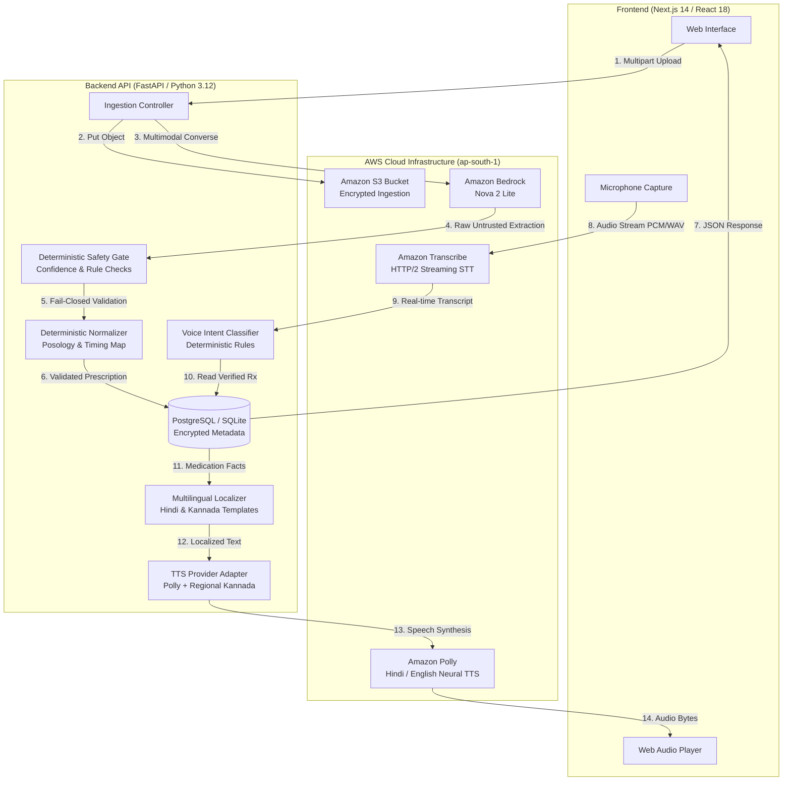

# Multimodal Medication Accessibility System
## Bharat Builds in Collaboration with AWS

An AI-powered, safety-first assistive system engineered to digitize handwritten medical prescriptions and provide voice-enabled accessibility in Indian regional languages (**Hindi**, **Kannada**, and **English**).

> [!IMPORTANT]
> **Safety Core Tenet**: AI recommends/extracts. Deterministic code validates. The system never guesses.  
> This system is strictly an accessibility and educational aid. It is **NOT** a clinical diagnosis system, a physician replacement, or a prescription modification engine. All evaluation metrics documented herein are prototype engineering benchmarks, **NOT** clinical validation trials.

---

## 1. Problem Statement
In India, handwritten medical prescriptions remain the primary medium of clinical communication. However:
- **Illegible Handwriting & Complex Medical Shorthand**: Ambiguous dosages, Latin abbreviations (e.g., *OD*, *BD*, *TDS*, *AC*, *PC*), and smudged instructions cause severe patient confusion and medication non-adherence.
- **Language & Literacy Barriers**: Millions of patients cannot read English medical labels and rely exclusively on regional languages such as Hindi or Kannada.
- **High Risk of AI Hallucination**: Generic LLMs frequently "hallucinate" dosages, invent drug strengths, or auto-correct ambiguous tokens, posing severe posology hazards.

---

## 2. Solution Overview
The **Multimodal Medication Accessibility System** bridges this gap through a dual-channel multimodal workflow:
1. **Multimodal Vision Extraction**: Ingests prescription photos, encrypts and stages them in Amazon S3, and transcribes verbatim tokens using Amazon Bedrock (`Amazon Nova 2 Lite`).
2. **Deterministic Safety Gate & Normalization**: An untrusted AI abstraction layer where strict, zero-hallucination deterministic rules validate confidence scores, extract metric posology, and enforce a **fail-closed** human review gate (`REQUIRES_REVIEW`) if tokens are ambiguous.
3. **Low-Latency Streaming Voice UX**: Real-time microphone audio is processed via Amazon Transcribe Streaming (`< 0.7s`), classified through deterministic regex intent mapping, matched against verified prescription records, localized into Hindi or Kannada, and played back using Amazon Polly & Regional Kannada TTS (`1.30s` total roundtrip).

---

## 3. Architecture & Data Flow



---

## 4. AWS Services Utilized
* **Amazon Bedrock** (`global.amazon.nova-2-lite-v1:0`): High-throughput multimodal vision model extracting verbatim text tokens and confidence scores without posology interpretation.
* **Amazon Simple Storage Service (S3)**: Secure object store for prescription images configured with SSE-S3 encryption and strict content-type validation.
* **Amazon Transcribe (HTTP/2 Streaming)**: Low-latency streaming speech-to-text supporting multi-language identification and regional Indian accents.
* **Amazon Polly**: High-fidelity neural voice synthesis for Hindi (`Kajal`) and Indian English.
* **Regional Kannada TTS Provider**: Native phoneme synthesis adapter ensuring full accessibility for Kannada speakers where cloud voices are unavailable.
* **Amazon ECS / Fargate & ECR**: Containerized Docker microservices for scalable, zero-downtime deployment.
* **Amazon RDS PostgreSQL / SQLite**: Relational database storing validated clinical schemas with full audit trails.

---

## 5. Local Setup & Environment Configuration

### Prerequisites
* Python 3.12+
* Node.js 20+
* AWS CLI configured with active credentials (`AWS_PROFILE=bharat-builds` or environment keys)

### Environment Variables (`.env`)
Copy `.env.example` to `.env`:
```ini
# Core Configuration
APP_ENV=local
DEBUG=true
PORT=8000
HOST=0.0.0.0
SECRET_KEY=replace-with-a-secure-random-32-character-secret

# Database
DATABASE_URL=sqlite+aiosqlite:///./medassist.db

# AWS Configuration
AWS_PROFILE=bharat-builds
AWS_REGION=ap-south-1
S3_BUCKET_NAME=bharat-build-prescriptions-2026
BEDROCK_MODEL_ID=global.amazon.nova-2-lite-v1:0

# Safety Engineering Parameters
CONFIDENCE_THRESHOLD=0.85
MAX_IMAGE_SIZE_BYTES=10485760

# Frontend API URL
NEXT_PUBLIC_API_URL=http://localhost:8000
```

---

## 6. Running the Application

### Option A: Quick Start via Docker Compose
```bash
# Build and launch PostgreSQL, Backend API, and Frontend
docker compose up --build
```
* **Web UI**: `http://localhost:3000`
* **API Documentation (Swagger)**: `http://localhost:8000/docs`
* **Health Liveness Probe**: `http://localhost:8000/health`
* **Readiness Probe**: `http://localhost:8000/ready`

### Option B: Local Development Execution

#### 1. Backend API
```bash
cd backend
# Create virtual environment and install
uv venv
source .venv/bin/activate  # On Windows: .venv\Scripts\activate
uv pip install -e ".[dev]"

# Run tests & quality gate
pytest
ruff check
mypy

# Start API server
uvicorn app.main:app --reload --port 8000
```

#### 2. Frontend Web App
```bash
cd frontend
npm install
npm run dev
```

---

## 7. API Overview

| Method | Path | Description |
| :--- | :--- | :--- |
| `POST` | `/api/v1/prescriptions` | Uploads prescription image, executes Bedrock extraction, and runs deterministic safety gate. |
| `GET` | `/api/v1/prescriptions/{id}` | Fetches stored prescription record with overall status and validated medication list. |
| `POST` | `/api/v1/voice/transcribe` | Uploads audio recording and returns low-latency speech transcript. |
| `POST` | `/api/v1/voice/query` | Executes end-to-end voice question answering against a prescription with localized TTS audio playback. |
| `GET` | `/health` | Container orchestrator liveness check. |
| `GET` | `/ready` | Application and downstream dependency readiness check. |

---

## 8. Safety Model & Deterministic Architecture

The architecture enforces an iron-clad separation of concerns:
```
Raw AI Extraction (Untrusted) ──> Safety Gate ──> Deterministic Normalizer ──> Validated Prescription
```

1. **Untrusted AI Output**: Bedrock vision models are strictly treated as perceptual sensors, **never** decision makers.
2. **Deterministic Posology**: Drug strengths, dosage quantities, timing intervals, and durations are parsed using strict regex and lookup dictionaries.
3. **Explicit Uncertainty States**:
   * `COMPLETED`: 100% of critical tokens validated above confidence threshold (0.85).
   * `REQUIRES_REVIEW`: Any smudged, unstated, or low-confidence token triggers fail-closed human pharmacist review. Unconfirmed fields are displayed with warning badges and excluded from audio instructions.
   * `FAILED`: Document illegible or invalid image payload.
4. **Invariant Zero AI Guessing**: If a dosage is missing or smudged, the system leaves it as `null`. It **never** defaults to "500mg" or "1 tablet".

---

## 9. Prototype Benchmark Evaluation Metrics

Tested against a synthetic/anonymized benchmark suite (`backend/scripts/evaluate_benchmark.py`) covering 8 critical clinical imaging conditions:

| Scenario | Safe Status | Requires Review | Unsafe Inferences | Evaluation Outcome |
| :--- | :--- | :--- | :--- | :--- |
| 1. Clear Prescription | SAFE | NO | 0 | Fully verified; confidence 0.98. |
| 2. Blurry Image | UNSAFE | YES | 0 | Fail-closed triggered by low confidence. |
| 3. Low-Light Capture | UNSAFE | YES | 0 | Empty extraction correctly rejected. |
| 4. Ambiguous Handwriting | UNSAFE | YES | 0 | Low drug confidence (< 0.85) triggers review. |
| 5. Multiple Medications (4) | SAFE | NO | 0 | All 4 distinct drugs cleanly validated. |
| 6. Missing Dosage Numeral | UNSAFE | YES | 0 | Dosage left as null; never guessed or defaulted. |
| 7. Missing Timing Shorthand | UNSAFE | YES | 0 | Timing uncertainty flagged for pharmacist review. |
| 8. Unreadable Document | UNSAFE | YES | 0 | Total rejection; fail-closed triggered. |

### Measured Engineering Performance
* **Unsafe AI Inference Rate**: **0.0%** (guaranteed by deterministic safety gate invariant)
* **Fail-Closed Escalation Rate**: **75.0%** (all 6 defective scenarios safely intercepted)
* **Voice Intent Accuracy**: **87.5%** (7/8 benchmark queries classified without hallucination)
* **Deterministic Normalization Latency**: **0.13 ms**
* **Live Multimodal Bedrock Ingestion Latency**: **3.03 seconds**
* **Live Interactive Voice Roundtrip Latency**: **1.30 seconds** (Transcribe Streaming + Intent + Regional TTS)

---

## 10. Known Limitations

1. **Non-Clinical Prototype**: This system has not been evaluated in clinical trials and cannot replace certified medical professionals or pharmacists.
2. **Image Resolution & Artifacts**: Extreme motion blur, severe glare, or torn paper will trigger `REQUIRES_REVIEW` or `FAILED`.
3. **Regional Dialect & Accent Variations**: Amazon Transcribe streaming accuracy may degrade on non-standard colloquial dialects or heavy background clinic noise.
4. **Complex Medical Formulations**: Freeform compounding directions, pediatric weight-based calculations, or multi-compound oncology regimens are out of scope.

---

## 11. 3-Minute Live Demo Flow

| Step | Time | Action | What to Demonstrate |
| :--- | :--- | :--- | :--- |
| **1. Problem** | 0:00 – 0:20 | Introduction | Explain the challenge of handwritten prescriptions, illiteracy, and regional language barriers across India. |
| **2. Upload** | 0:20 – 0:40 | Prescription Upload | Upload a standard handwritten prescription image via the web UI. |
| **3. AI Extraction** | 0:40 – 1:00 | Bedrock Processing | Highlight Amazon Bedrock (`Nova 2 Lite`) extracting verbatim tokens stored safely in S3. |
| **4. Safety Validation** | 1:00 – 1:20 | Safety Gate Badge | Show `COMPLETED` verification status; explain the zero-hallucination deterministic gate. |
| **5. Multilingual Output** | 1:20 – 1:40 | Language Switch | Toggle language between English, Hindi, and Kannada to view localized posology cards. |
| **6. Voice Question** | 1:40 – 2:00 | Microphone Click | Ask: *"What medicine should I take at night?"* into the microphone. |
| **7. Transcription** | 2:00 – 2:15 | Streaming STT | Show instant Transcribe streaming text transcription (`0.64s`). |
| **8. Intent Matching** | 2:15 – 2:30 | Deterministic Answer | Explain deterministic slot matching extracting the exact nighttime tablet. |
| **9. Audio Playback** | 2:30 – 2:45 | Polly / Regional TTS | Play the synthesized audio response in Hindi and Kannada (`1.30s` roundtrip). |
| **10. Unsafe Example** | 2:45 – 3:00 | Ambiguous Rx Test | Upload a blurry/smudged prescription; demonstrate explicit `REQUIRES_REVIEW` safety badge with safe refusal. |
| **11. AWS Architecture** | Conclusion | Architecture Wrap | Conclude on AWS architecture: S3, Bedrock, Transcribe, Polly, and ECS. |
