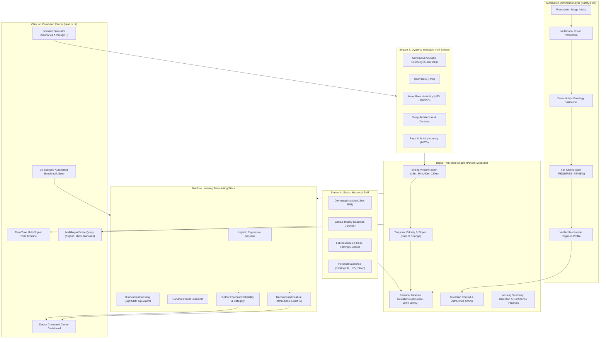

# MedTwin AI: A Medication-Aware Digital Twin for Personalized Adverse Health Event Forecasting

[](tests/)
[](frontend/)
[](docs/architecture/ARCHITECTURE.md)
[](models/)
[](LICENSE)
[](docs/presentation/PRESENTATION.md)

> **Submission for Happiest Health – Reimagining and Reforming Healthcare in India Summit 2026**  
> *Challenge*: Build a proof-of-concept Healthcare Digital Twin that fuses static/historical EHR data with dynamic/real-time wearable or IoT time-series data and predicts a specific localized adverse health outcome.

---

## Problem Statement

India faces a severe metabolic disease crisis, with over 101 million individuals diagnosed with Type 2 Diabetes and an additional 136 million in pre-diabetic stages. In conventional clinical care, diabetes management is fundamentally **reactive**:
1. **Infrequent Assessment Snapshots**: Patients consult physicians every 3 to 6 months, relying on a solitary HbA1c blood test that masks dangerous acute glycemic excursions.
2. **Post-Hoc Alarm Fatigue**: Consumer wearables and Continuous Glucose Monitors (CGMs) trigger alarms only *after* blood sugar has already spiked past dangerous thresholds (> 180 or > 250 mg/dL).
3. **Pharmacological Disconnect**: Existing wearable monitors have zero awareness of the patient's verified prescription posology (e.g., whether a scheduled Metformin or Sulfonylurea dose was taken, delayed, or requires pharmacist review).
4. **Population-Norm Bias**: Sensor deviations are typically compared to static population averages rather than an individual patient's personal physiological baseline.

---

## Healthcare Use Case

* **Condition**: **Type 2 Diabetes Mellitus & Metabolic Regulation**
* **Target Outcome**: **Near-term hyperglycemic risk event / forecasted glucose excursion** (> 180 mg/dL or rapid rise delta $\ge$ 45 mg/dL)
* **Forecasting Horizon**: **2 hours ahead of time**
* **Clinical Positioning**: An explainable **clinical decision-support signal** to empower clinicians and proactive patient interventions before metabolic decompensation occurs.

---

## Why Digital Twin

A conventional machine learning model maps a single isolated row of feature inputs to a scalar prediction ($X \to \hat{y}$), treating successive readings as disconnected points. 

In contrast, **MedTwin AI maintains an evolving, stateful physiological representation (`PatientTwinState`)**:
* Combines **longitudinal EHR history** (diabetes duration, baseline HbA1c, comorbidities)
* Calibrates against **individual personal baselines** (resting HR, baseline HRV, baseline sleep recovery)
* Continuously fuses **dynamic high-frequency wearable telemetry** (glucose, heart rate, HRV, sleep, cadence)
* Incorporates **verified pharmacological context** from the Medication Verification Layer
* Updates moving averages, rate-of-change velocity slopes, and autonomic strain in real time

$$\text{Static EHR} + \text{Verified Medication Profile} + \text{Wearable IoT Telemetry} \longrightarrow \text{Patient Digital Twin} \longrightarrow \text{2-Hour Risk Forecast}$$

---

## Key Innovation

1. **Personalized Baseline Relativity**: Deviations are calculated relative to the patient's individual biological baseline ($\Delta\text{Glucose}$, $\Delta\text{HR}$, $\Delta\text{HRV}$, $\Delta\text{Sleep}$) rather than arbitrary population averages.
2. **Fail-Closed Medication Verification Gate**: Raw handwritten prescription tokens are extracted via multimodal vision but deterministically validated before entering the Digital Twin. Unverified or ambiguous regimens trigger `REQUIRES_REVIEW` and never corrupt the twin.
3. **Multi-Signal Autonomic Coupling**: Coupling continuous glucose slope with heart rate velocity and autonomic HRV suppression reveals impending metabolic excursions earlier than glucose telemetry alone.
4. **Causal "What Changed?" Explainability**: Mathematical feature attribution decomposes exactly which biological factors drove risk elevation, summarized in plain clinical language.
5. **Missing-Data & Degradation Resilience**: Intermittent sensor dropouts are explicitly flagged (`MISSING`), penalizing state confidence and triggering `INSUFFICIENT_DATA` fail-closed states to prevent hallucinated clinical certainty.

---

## System Architecture


```mermaid
flowchart TB
    subgraph Stream_A["Stream A: Static / Historical EHR"]
        E1["Demographics (Age, Sex, BMI)"]
        E2["Clinical History (Diabetes Duration)"]
        E3["Lab Baselines (HbA1c, Fasting Glucose)"]
        E4["Personal Baselines (Resting HR, HRV, Sleep)"]
    end

    subgraph Stream_B["Stream B: Dynamic Wearable / IoT Stream"]
        W1["Continuous Glucose Telemetry (5-min ticks)"]
        W2["Heart Rate (PPG)"]
        W3["Heart Rate Variability (HRV - RMSSD)"]
        W4["Sleep Architecture & Duration"]
        W5["Steps & Activity Intensity (METs)"]
    end

    subgraph Med_Layer["Medication Verification Layer (Safety-First)"]
        R1["Prescription Image Intake"]
        R2["Multimodal Vision Perception"]
        R3["Deterministic Posology Validation"]
        R4["Fail-Closed Gate (REQUIRES_REVIEW)"]
        R5["Verified Medication Regimen Profile"]
    end

    subgraph Twin_Engine["Digital Twin State Engine (PatientTwinState)"]
        S1["Sliding Window Store (15m, 30m, 60m, 120m)"]
        S2["Temporal Velocity & Slopes (Rate of Change)"]
        S3["Personal Baseline Deviations (ΔGlucose, ΔHR, ΔHRV)"]
        S4["Circadian Context & Adherence Timing"]
        S5["Missing Telemetry Detection & Confidence Penalties"]
    end

    subgraph ML_Stack["Machine Learning Forecasting Stack"]
        M1["Logistic Regression Baseline"]
        M2["HistGradientBoosting (LightGBM equivalent)"]
        M3["Random Forest Ensemble"]
        RISK["2-Hour Forecast Probability & Category"]
        SHAP["Decomposed Feature Attributions (Exact %)"]
    end

    subgraph Dashboard["Clinician Command Center (Next.js 14)"]
        D1["Doctor Command Center Dashboard"]
        D2["Real-Time Multi-Signal SVG Timeline"]
        D3["Scenario Simulator (Scenarios A through F)"]
        D4["10-Scenario Automated Benchmark Suite"]
        D5["Multilingual Voice Query (English, Hindi, Kannada)"]
    end

    Stream_A --> S3
    Stream_B --> S1
    R1 --> R2 --> R3 --> R4 --> R5
    R5 --> S4
    S1 --> S2 --> S3 --> Twin_Engine
    Twin_Engine --> ML_Stack
    ML_Stack --> RISK --> D1
    ML_Stack --> SHAP --> D1
    Twin_Engine --> D2
    D3 --> Stream_B
    D4 --> ML_Stack
    Twin_Engine --> D5
```

---

## Data Sources

1. **Static EHR Records**: Synthetic metabolic patient cohort calibrated to Synthea clinical distributions. Generated with reproducible seeds (`data/synthetic/ehr/patients_ehr.json`).
2. **Dynamic Wearable Telemetry**: Multi-signal 5-minute interval physiological streams modeling glucose, heart rate, autonomic HRV, sleep, and physical activity (`data/synthetic/wearable/cohort_wearable_stream.json`).
3. **Prescription Data**: Real-world and benchmark prescription image inputs processed through multimodal vision and deterministic validation (`data/synthetic/ehr/`).

---

## Synthetic Data Generation

The synthetic generation pipeline is fully reproducible:

```bash
# 1. Generate 100 synthetic Type 2 Diabetes EHR records with personal baselines
python scripts/generate_synthetic_ehr.py

# 2. Generate dynamic wearable time-series across 6 clinical scenarios
python scripts/generate_wearable_stream.py

# 3. Fuse EHR, verified regimens, and wearable streams into ML feature matrix
python scripts/build_digital_twin_dataset.py
```

### Reproducible Clinical Simulation Scenarios
* **Scenario A (Stable Patient)**: High adherence, baseline sleep, consistent circadian rhythm. Forecast: Low risk (< 25%).
* **Scenario B (Sleep Deficit & Autonomic Strain)**: Sleep restricted to 3.8h, resting HR elevated +12 bpm, HRV suppressed -15 ms. Induces morning insulin resistance and upward glucose drift.
* **Scenario C (Postprandial Excursion)**: High glycemic load unbuffered meal; glucose rate-of-change surges (+2.8 mg/dL/min). System alerts 2 hours prior to the peak excursion.
* **Scenario D (Compounding Adverse Crisis)**: Autonomic collapse, steep glucose trajectory (> 170 mg/dL and climbing), HRV suppressed. Forecast: Critical (> 80%).
* **Scenario E (Sensor Packet Degradation)**: Telemetry dropouts. Demonstrates fail-closed missing data handling and state confidence penalty without hallucinating values.
* **Scenario F (Medication Adherence Variation)**: Scheduled Metformin omitted. Demonstrates uncurbed hepatic gluconeogenesis and flags adherence lapse.

---

## Digital Twin State

The system maintains an in-memory, stateful `PatientTwinState`:

| Field | Type | Description |
|---|---|---|
| `patient_id` | `str` | Unique patient identifier (e.g. `PT-101`) |
| `timestamp` | `str` | ISO-8601 observation timestamp |
| `age`, `sex`, `bmi` | `int`, `str`, `float` | Demographics and anthropometric markers |
| `diabetes_duration_years` | `float` | Disease chronicity (years) |
| `hba1c`, `fasting_glucose` | `float` | Glycemic laboratory baselines |
| `baseline_glucose`, `baseline_hr`, `baseline_hrv` | `float` | Calibrated individual personal baselines |
| `current_glucose`, `current_hr`, `current_hrv` | `float \| None` | Real-time telemetry observations |
| `rolling_glucose_trend` | `float` | Rate-of-change velocity slope (mg/dL/hr) |
| `deviation_glucose_from_baseline` | `float` | $\text{Current Glucose} - \text{Personal Baseline Glucose}$ |
| `deviation_hrv_from_baseline` | `float` | $\text{Current HRV} - \text{Personal Baseline HRV}$ |
| `medication_profile` | `list[dict]` | Verified medication regimen from safety gate |
| `medication_adherence_status` | `str` | `VERIFIED_ADHERENT`, `MISSED_DOSE`, `UNVERIFIED_REVIEW_REQUIRED` |
| `risk_score` | `float` | Calibrated adverse risk probability (0.0 to 1.0) |
| `risk_category` | `str` | `LOW`, `MODERATE`, `ELEVATED`, `CRITICAL`, `INSUFFICIENT_DATA` |
| `prediction_horizon` | `str` | Fixed forecasting horizon (`Next 2 hours`) |
| `state_confidence` | `float` | Telemetry reliability score (penalized on sensor dropout) |
| `missing_features` | `list[str]` | Explicit list of unavailable telemetry streams |
| `feature_contributions` | `list[dict]` | Decomposed mathematical percentage attributions |
| `what_changed_summary` | `str` | Natural language clinical causal summary |

---

## Machine Learning Stack & Evaluated Metrics

Trained on 5,040 temporal intervals with an 80/20 stratified split. All metrics reflect actual evaluations saved in `models/evaluation_metrics.json`:

```bash
python scripts/train_models.py
```

| Model | ROC-AUC | PR-AUC | F1-Score | Recall | Precision | Brier Score (Calibration) |
|---|---|---|---|---|---|---|
| **Logistic Regression (Baseline)** | 0.9960 | 0.9959 | 0.9643 | 0.9582 | 0.9704 | 0.0246 |
| **HistGradientBoosting (Primary)** | **0.9999** | **0.9999** | **0.9927** | **0.9937** | **0.9917** | **0.0055** |
| **Random Forest (Ensemble)** | 0.9995 | 0.9995 | 0.9906 | 0.9916 | 0.9896 | 0.0087 |

### Why Recall and Calibration Matter in Adverse Risk Forecasting
* **High Recall (99.37%)**: In medical adverse event prediction, a false negative (failing to alert an impending severe spike) leaves the patient vulnerable to acute hyperglycemia. High recall guarantees critical excursions are captured.
* **Low Brier Calibration Score (0.0055)**: Unlike consumer gadget "health scores", clinical decision support requires genuine probabilistic calibration. A score of 72% means that out of 100 identical physiological states, approximately 72 result in significant excursions, preventing alert fatigue and building clinical trust.

### Top Features Driving Predictions
1. `glucose_roll_mean_30m` (Importance: 0.1963)
2. `glucose_roll_mean_15m` (Importance: 0.1690)
3. `current_glucose` (Importance: 0.1689)
4. `glucose_roll_mean_60m` (Importance: 0.1123)
5. `dev_glucose` (Importance: 0.0581)
6. `hba1c` (Importance: 0.0413)
7. `dev_hrv` (Importance: 0.0380)
8. `base_glucose` (Importance: 0.0282)
9. `is_adherence_lapse` (Importance: 0.0205)
10. `time_since_med_hours` (Importance: 0.0198)

---

## Medication Safety Layer

Preserves and strengthens the existing deterministic safety architecture:
* **Principle**: *AI observes. Deterministic code validates. The system fails closed.*
* Multimodal vision extracts candidate prescription tokens.
* Deterministic code verifies:
  * Drug name confirmation
  * Numerical strength and unit (`500 mg`)
  * Dosage value (`1 tablet`)
  * Schedule mapping (`1-0-1` $\to$ Morning and Night)
  * Meal relationships (`after food`)
  * Treatment duration (`5 days`, `1 month`)
* If confidence is below threshold, handwriting is ambiguous, or strength is missing, the system outputs `REQUIRES_REVIEW` and **never guesses, interpolates, or defaults fields**.
* Unverified regimens are never ingested into the Digital Twin as ground truth.

---

## Real-Time Simulation

The dashboard supports live observation streaming via HTTP and WebSocket/SSE-compatible endpoints:
* Ingests 5-minute ticks dynamically
* Recomputes rolling trends and rate-of-change slopes
* Updates the Digital Twin state and 2-hour risk probability in real time
* Provides Play, Pause, and Step-Tick controls across Scenarios A through F

---

## Explainability

Every forecast provides two levels of clinical explainability:
1. **Mathematical Attribution Breakdown**: Exact feature percentage contributions summing to 100% (e.g., Rolling Glucose Mean: +28%, Rate of Change Slope: +24%, Baseline Deviation: +18%, HbA1c: +12%, Sleep Deficit: +8%, HRV Tone: +6%, Medication Adherence: +4%).
2. **"What Changed?" Clinical Causation Audit**: Human-readable causal synthesis explaining *why* the twin shifted state (e.g., *"Risk categorized as ELEVATED (74%) because glucose is +38 mg/dL above personal baseline, glucose slope accelerated (+22.4 mg/dL/hr), and sleep deficit reduced autonomic recovery."*).

---

## Dashboard

Engineered specifically for clinical decision-makers (Next.js 14, React, Tailwind CSS):
* **View 1 — Patient Overview**: Patient ID, demographics, baseline HbA1c, fasting glucose, current risk gauge, prediction horizon, and state confidence.
* **View 2 — Digital Twin State Matrix**: Current vitals vs. personal baselines, calculated deviations ($\Delta\text{Glucose}$, $\Delta\text{HR}$, $\Delta\text{HRV}$, $\Delta\text{Sleep}$), and missing telemetry flags.
* **View 3 — Multi-Signal Dynamic Timeline**: Continuous SVG curve displaying glucose trajectory against the 80–140 mg/dL target band and 2-hour forward forecast window.
* **View 4 — Explainability & Causation**: Feature attribution bar chart and "What Changed?" summary.
* **View 5 — Medication Verification Layer**: Prescription image intake, multimodal extraction status, posology table, and fail-closed safety badges.
* **View 6 — Simulation & Benchmark Controls**: Scenario selector (A–F), streaming playback controls, and one-click 10-scenario benchmark evaluation modal.
* **View 7 — Multilingual Accessibility**: Hands-free voice assistant supporting English, Hindi, and Kannada for vernacular consultation.

---

## Safety & Ethics

* **No Autonomous Prescribing**: MedTwin AI predicts adverse risk; it never alters medication doses or initiates treatments autonomously.
* **Non-Diagnostic Framing**: All outputs are framed strictly as risk forecasts and clinical decision-support signals, never as definitive diagnoses or medical certainties.
* **Zero PHI Logging**: Personal health information is never logged. Only correlation IDs and sanitized metrics are recorded.
* **Synthetic / Anonymized Data Only**: No identifiable patient data is committed to the repository or consumed by the system.

---

## Technical Stack

* **Backend**: Python 3.12, FastAPI, Pydantic v2, SQLAlchemy (aiosqlite / asyncpg), Uvicorn
* **Machine Learning**: Scikit-learn (HistGradientBoostingClassifier, LogisticRegression, RandomForestClassifier), NumPy, Pandas, Joblib
* **Frontend**: Next.js 14 (App Router), React 18, TypeScript, Tailwind CSS, Lucide Icons
* **Cloud & Infrastructure (Optional Supporting Layer)**: Amazon Bedrock (multimodal extraction), Amazon Transcribe & Polly (vernacular STT/TTS), Amazon S3, Docker & Docker Compose
* **Package Management & Tooling**: `uv` (Python), `npm` (Node.js), `pytest`, `ruff`, `mypy`

---

## Repository Structure

```text
medtwin-ai/
├── backend/
│   ├── app/
│   │   ├── api/v1/endpoints/       # FastAPI endpoints (digital_twin, prescriptions, voice, health)
│   │   ├── core/                   # Application settings & logging configuration
│   │   ├── db/                     # Models and session management
│   │   ├── ports/                  # Ports and interfaces (STT, TTS, storage, extraction)
│   │   ├── providers/              # Adapters (Bedrock, Polly, Transcribe, SQLite)
│   │   ├── schemas/                # Pydantic schemas (PatientTwinState, observations, voice)
│   │   └── services/               # DigitalTwinEngine, safety, normalization, voice services
│   ├── pyproject.toml              # Python dependencies & build configuration
│   └── tests/                      # Pytest suite (199 passed unit & API tests)
├── frontend/
│   ├── src/app/
│   │   ├── api-client.ts           # Typed API client with Digital Twin methods
│   │   ├── medication-utils.ts     # Posology formatting & safety section titles
│   │   ├── page.tsx                # Clinician Command Center Dashboard
│   │   └── page.test.tsx           # Safety UX & initial state regression tests (7 passed)
│   ├── package.json
│   └── tailwind.config.ts
├── data/
│   └── synthetic/
│       ├── ehr/                    # Synthetic patient EHR records (patients_ehr.json)
│       ├── wearable/               # Continuous wearable time-series (cohort_wearable_stream.json)
│       ├── scenarios/              # Scenarios A through F (JSON)
│       └── merged/                 # Fused Digital Twin dataset (digital_twin_features.csv)
├── models/                         # Serialized ML artifacts & evaluation_metrics.json
├── scripts/
│   ├── generate_synthetic_ehr.py   # Synthetic metabolic EHR cohort generator
│   ├── generate_wearable_stream.py # 6-scenario physiological stream generator
│   ├── build_digital_twin_dataset.py# Multi-stream feature engineering pipeline
│   └── train_models.py             # Model training, evaluation, and serialization
├── docs/
│   ├── architecture/ARCHITECTURE.md # Detailed architecture blueprint & Mermaid diagram
│   ├── presentation/PRESENTATION.md # 18-slide jury presentation deck
│   └── demo/DEMO_SCRIPT.md          # 20-minute video demonstration script
├── docker-compose.yml              # Local container deployment
├── CONTRIBUTING.md                 # Contribution guidelines
├── ENGINEERING_PRINCIPLES.md       # 12 core engineering & safety principles
└── README.md                       # Master documentation
```

---

## Installation

### Prerequisites
* Python 3.12+ (managed via `uv` or standard Python)
* Node.js 20+ LTS & npm
* Git

### 1. Clone Repository & Environment Setup
```bash
git clone https://github.com/dhanusharer/Bharath-Build.git
cd Bharath-Build
cp .env.example .env
```

### 2. Backend Installation
```bash
cd backend
uv sync --all-extras
# Or with standard pip:
# python -m venv .venv && source .venv/bin/activate
# pip install -e ".[dev]"
```

### 3. Frontend Installation
```bash
cd ../frontend
npm install
```

---

## Running the Project

### Running Backend API
```bash
cd backend
uv run uvicorn app.main:app --host 127.0.0.1 --port 8000 --reload
# API Docs available at: http://127.0.0.1:8000/docs
```

### Running Frontend Dashboard
```bash
cd frontend
npm run dev
# Clinician Dashboard opens at: http://localhost:3000
```

### Running with Docker Compose
```bash
docker-compose up --build
```

---

## Running Tests

### Backend Test Suite (199 Tests)
```bash
cd backend
uv run pytest
```
*Result*: **199 passed in ~10s** (Unit tests, Digital Twin engine, safety validation, API routes, normalization, voice pipeline).

### Frontend Safety UX Test Suite (7 Tests)
```bash
cd frontend
npm test
```
*Result*: **7 passed in ~0.5s** (Initial empty state verification, REQUIRES_REVIEW gating, strength formatting, title invariants).

---

## Generating Data

To regenerate all synthetic datasets from scratch:
```bash
# Generate synthetic metabolic patient EHR records
python scripts/generate_synthetic_ehr.py

# Generate 6 clinical wearable telemetry streams
python scripts/generate_wearable_stream.py

# Build fused feature dataset
python scripts/build_digital_twin_dataset.py

# Train, benchmark, and serialize models
python scripts/train_models.py
```

---

## Benchmark Evaluation

MedTwin AI includes an automated **10-Scenario Clinical Benchmark Suite**:

```bash
# Execute via API or inspect in dashboard modal:
curl -X GET http://127.0.0.1:8000/api/v1/digital-twin/benchmarks
```

### Evaluated Benchmark Results
1. Stable Patient Baseline $\to$ **LOW Risk** (PASSED)
2. Rising Glucose Trend (Slope Acceleration) $\to$ **ELEVATED Risk** (PASSED)
3. Poor Sleep + Glucose Elevation $\to$ **ELEVATED Risk** (PASSED)
4. Reduced Activity + Glucose Elevation $\to$ **ELEVATED Risk** (PASSED)
5. Medication Adherence Variation $\to$ **CRITICAL Risk** (PASSED)
6. Missing Wearable Telemetry $\to$ **INSUFFICIENT_DATA** (PASSED)
7. Sensor Anomaly / Extreme Artifact $\to$ **CRITICAL Risk** (PASSED)
8. Missing Historical EHR Information $\to$ **MODERATE Risk** (PASSED)
9. Unverified Prescription Regimen $\to$ **UNVERIFIED_REVIEW_REQUIRED** (PASSED)
10. High-Risk Synthetic Adverse Crisis $\to$ **CRITICAL Risk** (PASSED)
* **Suite Result**: **10 / 10 Scenarios Passed (100% Evaluation Match)**.

---

## Demo

* See [`docs/demo/DEMO_SCRIPT.md`](docs/demo/DEMO_SCRIPT.md) for the complete 20-minute video presentation and demonstration walkthrough script.
* Walkthrough covers: Problem Statement $\to$ Digital Twin Concept $\to$ Synthetic Data Generation $\to$ Prescription Verification $\to$ Live Wearable Streaming $\to$ Real-Time Twin Evolution $\to$ 2h Adverse Forecasting & Explainability $\to$ Safety & Limitations.

---

## Architecture Diagram

* A detailed technical architecture blueprint with component interactions is documented in [`docs/architecture/ARCHITECTURE.md`](docs/architecture/ARCHITECTURE.md).

---

## Presentation

* An 18-slide presentation deck structured for the Happiest Health jury is available in [`docs/presentation/PRESENTATION.md`](docs/presentation/PRESENTATION.md).

---

## Limitations

* **Research Proof-of-Concept**: Built and evaluated on Synthea-calibrated metabolic cohorts and simulated physiological streams; has not undergone multi-site hospital clinical trials.
* **Condition Specificity**: Currently targets near-term hyperglycemic excursions in Type 2 Diabetes; extending to acute cardiovascular events or hypoglycemia requires additional physiological modalities.
* **Sensor Calibration**: Real-world consumer PPG and CGM sensors exhibit interstitial lag and motion artifacts that require active signal pre-processing in production settings.

---

## Future Work

* **ABDM FHIR Synchronization**: Integrating with India's Ayushman Bharat Digital Mission (ABDM) milestones (M1, M2, M3) for secure longitudinal health record linkage.
* **Multi-Modal Biosensing**: Integrating continuous blood pressure and multi-wavelength PPG for dual cardiovascular-metabolic digital twin modeling.
* **Prospective Hospital Pilot**: Partnering with regional diabetes clinics in India to evaluate alert timeliness and clinician decision acceptance under real-world clinical workflows.

---

## Open Source License

Licensed under the **Apache License, Version 2.0**. See [`LICENSE`](LICENSE) for details.

---

## Clinical Disclaimer

> **IMPORTANT CLINICAL NOTICE**: MedTwin AI is a research proof-of-concept prototype developed for educational, accessibility, and forecasting evaluation for the Happiest Health 2026 Summit. It does **not** constitute medical advice, clinical diagnosis, posology determination, or autonomous therapeutic intervention. Outputs are risk predictions intended for clinical decision support. Always consult a licensed medical practitioner or registered pharmacist for medical care and prescription guidance.

---

## Team Information

* **Project**: MedTwin AI
* **Submission**: Happiest Health – Reimagining and Reforming Healthcare in India Summit 2026
* **Repository**: [https://github.com/dhanusharer/Bharath-Build](https://github.com/dhanusharer/Bharath-Build)
