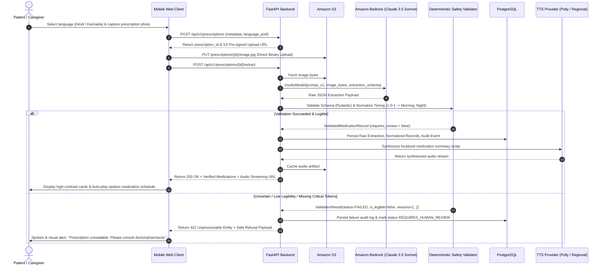
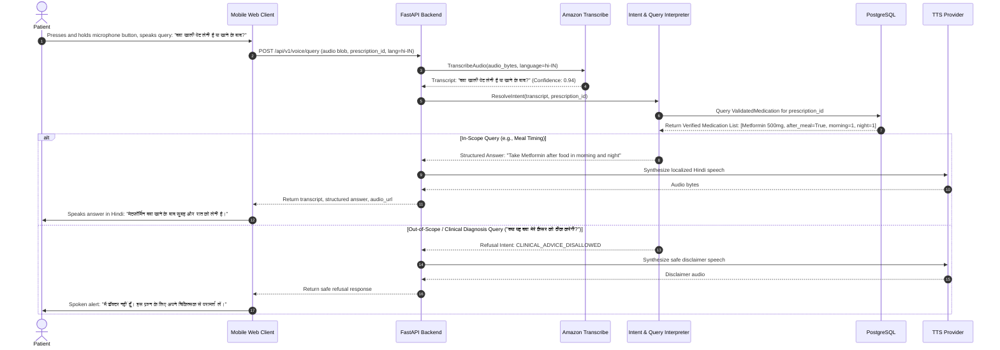

# User Journeys & Interaction Specifications

**Document Version**: 1.0.0 (Phase 0 Freeze)  
**Target Systems**: Web UI (Mobile-responsive), Backend Processing Pipeline, Voice Engine  

---

## 1. Actors and Roles

| Actor | Description | Primary Interface | Primary Needs |
| :--- | :--- | :--- | :--- |
| **Elderly Patient** | Senior citizen with chronic illnesses, low English fluency, possibly presbyopic | Mobile Web UI / Voice Assistant | Clear voice instructions in native tongue, high contrast UI, simple tap-to-talk. |
| **Vernacular User** | Native Hindi or Kannada speaker with minimal formal medical literacy | Mobile Web UI / Audio Stream | Hearing exact times to take tablets without deciphering clinical Latin/English handwriting. |
| **Family Caregiver** | Adult child or relative managing elderly family member's treatment | Mobile Web UI / Visual Review | Rapid verification that they are administering the right pill at the right hour. |
| **Healthcare Volunteer** | Rural community health worker (e.g., ASHA/Anganwadi) assisting patients | Tablet / Mobile Web UI | Batch assistance, verification of doctor directions before advising villagers. |

---

## 2. Comprehensive User Journeys

### User Journey A: Prescription Upload & Vernacular Audio Explanation

#### Step-by-Step State Lifecycle
1. **State: `CREATED`**: Client creates a session record specifying language (`hi-IN` or `kn-IN`).
2. **State: `IMAGE_UPLOADED`**: Mobile client uploads binary to S3 using a short-lived pre-signed URL (15-minute expiration).
3. **State: `EXTRACTION_IN_PROGRESS`**: Backend sends image payload with extraction prompt and JSON schema to Bedrock.
4. **State: `VALIDATED`**: Deterministic engine verifies all required fields (`drug_name`, `dose_value`, `intake_timing`) pass non-null and confidence gates.
5. **State: `AUDIO_SYNTHESIZED`**: Localized vernacular explanation rendered, converted to audio, and queued for player playback.

---

### User Journey B: Interactive Voice Clarification Query

---

### User Journey C: Poor-Quality / Ambiguous Prescription (Safe Refusal)

1. **Trigger**: An image is submitted where lighting is uneven, text is blurred, or the doctor's handwriting for the dosage is an indecipherable scrawl.
2. **AI Model Response**: Bedrock returns `drug_name: "Amoxi..."`, `dose_value: null`, `is_legible: false`, `requires_review: true`.
3. **Safety Engine Evaluation**:
   * Rule `SAFE-001` (Mandatory Complete Posology) triggers: If `dose_value` is `null` or `is_legible` is `false`, the medication record cannot be marked as verified.
   * Prescription status is set to `UNCERTAIN_INPUT`.
4. **User Feedback Protocol**:
   * Visual UI displays a warning banner with guidance: "Camera was too close or handwriting is unclear."
   * Spoken audio generated in the active language:
     * **Hindi**: *"हम इस पर्चे की सही खुराक नहीं पढ़ पा रहे हैं। कृपया अधिक रोशनी में दोबारा फोटो लें या अपने डॉक्टर से संपर्क करें।"*
     * **Kannada**: *"ಈ ಪ್ರಿಸ್ಕ್ರಿಪ್ಷನ್‌ನ ವಿವರಗಳು ಸರಿಯಾಗಿ ಓದಲು ಸಾಧ್ಯವಾಗುತ್ತಿಲ್ಲ. ದಯವಿಟ್ಟು ಸ್ಪಷ್ಟವಾದ ಫೋಟೋ ತೆಗೆದುಕೊಳ್ಳಿ ಅಥವಾ ನಿಮ್ಮ ವೈದ್ಯರನ್ನು ಸಂಪರ್ಕಿಸಿ."*
5. **No Speculation**: The system strictly refuses to output any partial dosage schedule.

---

### User Journey D: Partial Prescription Legibility (Mixed Legibility)

When a prescription contains multiple items (e.g., 3 medications), and 2 are 100% legible while 1 is unreadable:
1. **Rule**: The system partitions the extraction into `verified_medications` and `unverified_items`.
2. **Audio Walkthrough**: The audio informs the user about the verified medications, followed by an explicit spoken warning regarding the unreadable item:
   * *"2 दवाओं के निर्देश स्पष्ट हैं, लेकिन 1 दवा की लिखावट समझ नहीं आ रही है। कृपया उस दवा के लिए फार्मासिस्ट से पूछें।"*
3. **Safety Display**: The unverified item card is rendered with an amber warning badge `REQUIRES PHARMACIST CLARIFICATION`.
