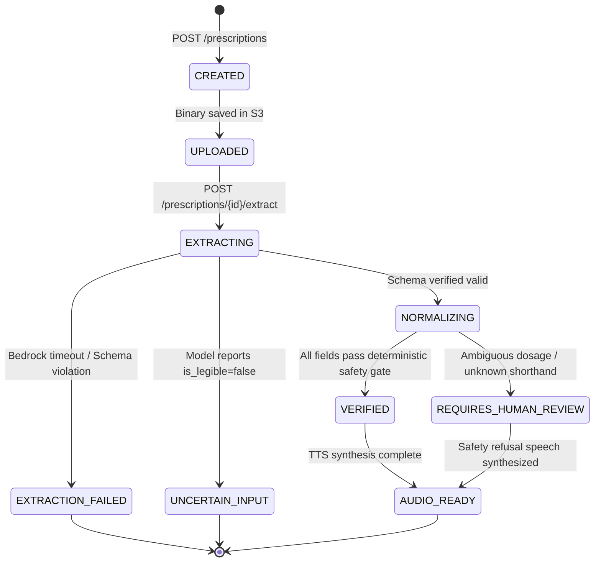

# Data Flow & State Transition Specifications

**Document Version**: 1.0.0 (Phase 0 Freeze)  
**Scope**: Ingestion, Extraction, Validation, Voice Processing, and Failure Branches  

---

## 1. End-to-End Data Flow (Prescription Lifecycle)

```mermaid
flowchart TD
    Start([User Captures Image]) --> UploadUI[Client Requests Upload URL]
    UploadUI --> API_Presign[FastAPI: POST /prescriptions]
    API_Presign --> S3_Presign[(Amazon S3: Issue Presigned URL)]
    S3_Presign --> Client_Upload[Client PUTs Image to S3]
    Client_Upload --> TriggerExtract[Client Calls POST /prescriptions/{id}/extract]
    
    TriggerExtract --> FetchS3[Backend Reads S3 Object]
    FetchS3 --> BedrockCall[Invoke Bedrock Claude 3.5 Sonnet with Rigid JSON Schema]
    
    BedrockCall --> CheckSchema{Valid JSON & Matches Pydantic Schema?}
    CheckSchema -- No: Malformed AI Output --> FailClosed_Schema[Status: EXTRACTION_FAILED<br/>HTTP 502 Bad Gateway / Safe Refusal]
    
    CheckSchema -- Yes --> ConfidenceCheck{Confidence >= 0.85 & is_legible == True?}
    ConfidenceCheck -- No: Unreadable/Smudged --> FailClosed_Legible[Status: REQUIRES_HUMAN_REVIEW<br/>HTTP 422 Safe Refusal<br/>Prompt Retake or Pharmacist]
    
    ConfidenceCheck -- Yes --> NormEngine[Deterministic Posology Normalizer]
    NormEngine --> CheckTokens{Valid Shorthand Pattern?<br/>e.g. 1-0-1, OD, BD}
    CheckTokens -- No: Ambiguous Pattern --> FailClosed_Pattern[Status: UNCERTAIN_TIMING<br/>Flag Medication requires_review=True]
    
    CheckTokens -- Yes --> PersistDB[(PostgreSQL: Save Raw, Normalized, & Audit Event)]
    PersistDB --> Localize[Deterministic Template Engine: Generate Hindi/Kannada Script]
    Localize --> TTS[Invoke ITTSProvider: Synthesize Audio]
    TTS --> S3Audio[(Store Audio in S3)]
    S3Audio --> ClientSuccess([Return 200 OK + Verified Medications + Audio Stream URL])
```

---

## 2. Interactive Voice Data Flow

```mermaid
flowchart TD
    VoiceStart([User Speaks into Microphone]) --> ClientAudio[Capture 16kHz Audio Blob]
    ClientAudio --> PostVoice[FastAPI: POST /api/v1/voice/query]
    PostVoice --> Transcribe[Amazon Transcribe Speech-to-Text]
    
    Transcribe --> CheckAudioConf{STT Confidence >= 0.70?}
    CheckAudioConf -- No: Audio Inaudible --> AudioRetry[HTTP 400: Spoken Audio Unclear<br/>"कृपया दोबारा बोलें"]
    
    CheckAudioConf -- Yes --> IntentClassify[Intent Resolution Engine]
    IntentClassify --> CheckIntentType{Intent Classification}
    
    CheckIntentType -- Clinical / Diagnostic / Out-of-Scope --> SafeDisclaimer[Synthesize Safe Clinical Disclaimer<br/>"मैं डॉक्टर नहीं हूँ। डॉक्टर से परामर्श लें।"]
    
    CheckIntentType -- Valid Schedule / Meal Query --> DBQuery[(Fetch Validated Prescription Data)]
    DBQuery --> CheckMedStatus{Medication Requires Review?}
    CheckMedStatus -- Yes: Unverified Drug --> RefuseSpecific[Synthesize Refusal for Unverified Drug<br/>"इस दवा की जानकारी की पुष्टि नहीं हो सकी है।"]
    CheckMedStatus -- No: Verified Drug --> FormatAnswer[Format Deterministic Fact Answer]
    
    FormatAnswer --> TTSVoice[Synthesize Spoken Answer via ITTSProvider]
    SafeDisclaimer --> TTSVoice
    RefuseSpecific --> TTSVoice
    TTSVoice --> ClientVoiceReturn([Return Audio URL + Text to Client])
```

---

## 3. Prescription Session State Machine

The prescription resource transitions through deterministic states managed by the backend engine:



### State Definitions & Safety Invariants

| State | Invariant Condition | Allowed Downstream Actions |
| :--- | :--- | :--- |
| `CREATED` | Record initialized in DB; S3 pre-signed upload URL generated. | Image binary upload only. |
| `UPLOADED` | Image binary confirmed in S3 bucket; MIME type verified. | Trigger extraction via Bedrock. |
| `EXTRACTING` | Request sent to Amazon Bedrock; asynchronous worker waiting. | Wait or timeout. |
| `EXTRACTION_FAILED` | Bedrock timed out, threw exception, or returned malformed JSON. | Return HTTP 502/504; no clinical data rendered. |
| `UNCERTAIN_INPUT` | Model flagged `is_legible = false` or confidence < threshold. | Safe refusal voice message; require re-upload. |
| `NORMALIZING` | Raw JSON parsed by Pydantic; deterministic regex executing. | Internal state machine transition. |
| `REQUIRES_HUMAN_REVIEW` | At least 1 medication has ambiguous posology or unverified token. | Visual warning banner; refuse voice answering on unverified tokens. |
| `VERIFIED` | 100% of extracted medications have passed all safety gates. | Localized audio synthesis; enable voice queries. |
| `AUDIO_READY` | Vernacular audio synthesized and stored in S3. | Complete client playback. |

---

## 4. Failure Branch Matrix

Every failure branch triggers explicit isolation protocols:
1. **Network / AWS Service Outage**: System reports upstream unavailability; zero fallback to uncontrolled local inference.
2. **Ambiguous Handwriting**: System flags specific field (`dose_value: null`, `schedule: UNCERTAIN`) and blocks dosage guidance.
3. **Clinical Advice Interception**: Queries asking for diagnostic evaluations or altering dosages are intercepted before any data formatting and replied to with a fixed disclaimer.
