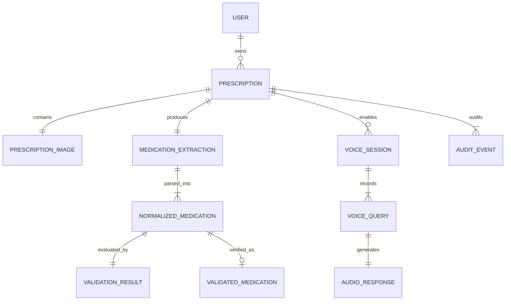

# Domain Model & Entity Relationship Specification

**Document Version**: 1.0.0 (Phase 0 Freeze)  
**Paradigm**: Domain-Driven Design (DDD) Tactical Modeling  

---

## 1. Domain Entity Relationship Diagram

---

## 2. Core Entities & Invariants

### 2.1 User
Represents the patient or caregiver accessing the accessibility system.
* `user_id`: UUID (Primary Key)
* `phone_hash`: String (SHA-256 hash of mobile number; zero plain text)
* `preferred_language`: Enum (`hi-IN`, `kn-IN`)
* `created_at`: Timestamp UTC

### 2.2 Prescription (Aggregate Root)
Represents a distinct medical prescription document processing session.
* `prescription_id`: UUID (Primary Key)
* `user_id`: UUID (Foreign Key, nullable for guest/demo mode)
* `status`: Enum (`CREATED`, `UPLOADED`, `EXTRACTING`, `VERIFIED`, `REQUIRES_HUMAN_REVIEW`, `FAILED`)
* `language_preference`: Enum (`hi-IN`, `kn-IN`)
* `created_at`: Timestamp UTC
* `updated_at`: Timestamp UTC

### 2.3 PrescriptionImage
Stores metadata for the uploaded physical prescription artifact.
* `image_id`: UUID (Primary Key)
* `prescription_id`: UUID (Foreign Key)
* `s3_bucket`: String
* `s3_key`: String (e.g., `prescriptions/{prescription_id}/original.jpg`)
* `mime_type`: Enum (`image/jpeg`, `image/png`, `image/webp`)
* `file_size_bytes`: Integer
* `sha256_checksum`: String
* `uploaded_at`: Timestamp UTC

### 2.4 MedicationExtraction (Raw Model Layer)
Immutable record of the raw multimodal output from Amazon Bedrock.
* `extraction_id`: UUID (Primary Key)
* `prescription_id`: UUID (Foreign Key)
* `model_id`: String (e.g., `anthropic.claude-3-5-sonnet-20241022-v2:0`)
* `prompt_version`: String (e.g., `v1.2.0`)
* `raw_response_payload`: JSONB (Complete verbatim JSON returned by the model)
* `overall_legibility`: Boolean
* `latency_ms`: Integer
* `extracted_at`: Timestamp UTC

### 2.5 NormalizedMedication (Parsed Layer)
Deterministically parsed representation of an individual medication entry.
* `normalized_med_id`: UUID (Primary Key)
* `extraction_id`: UUID (Foreign Key)
* `raw_drug_token`: String (e.g., `Tab Metformin 500mg`)
* `drug_name`: String (e.g., `Metformin`)
* `drug_confidence`: Float (0.00 to 1.00)
* `dosage_form`: Enum (`TABLET`, `CAPSULE`, `SYRUP`, `INJECTION`, `DROPS`, `OINTMENT`, `UNKNOWN`)
* `strength_value`: Float Nullable
* `strength_unit`: Enum (`mg`, `mcg`, `g`, `ml`, `IU`, `null`)
* `morning`: Integer (Count of units, default 0)
* `afternoon`: Integer (Count of units, default 0)
* `evening`: Integer (Count of units, default 0)
* `night`: Integer (Count of units, default 0)
* `before_meal`: Boolean Nullable
* `after_meal`: Boolean Nullable
* `duration_days`: Integer Nullable
* `raw_schedule_shorthand`: String (e.g., `1-0-1`)

### 2.6 ValidationResult (Safety Gate Layer)
Audit record of deterministic rules applied to a normalized medication.
* `validation_id`: UUID (Primary Key)
* `normalized_med_id`: UUID (Foreign Key)
* `is_safe`: Boolean
* `is_legible`: Boolean
* `requires_human_review`: Boolean
* `violated_rules`: Array of Strings (e.g., `["MISSING_DOSAGE_VALUE", "LOW_NAME_CONFIDENCE"]`)
* `evaluated_at`: Timestamp UTC

### 2.7 ValidatedMedication (Verified Read Layer)
The authoritative entity used exclusively by downstream voice and localization engines.
* `validated_med_id`: UUID (Primary Key)
* `prescription_id`: UUID (Foreign Key)
* `drug_name`: String
* `strength_display`: String (e.g., `500 mg`)
* `daily_intake_summary`: String (e.g., `Morning: 1, Night: 1`)
* `meal_instruction`: Enum (`BEFORE_MEAL`, `AFTER_MEAL`, `WITH_MEAL`, `UNSPECIFIED`)
* `duration_days`: Integer Nullable
* *Invariant*: An entry exists here ONLY IF `is_safe == true` and `requires_human_review == false`.

### 2.8 VoiceSession & VoiceQuery
Captures conversational queries and interactions against a validated prescription.
* `session_id`: UUID (Primary Key)
* `prescription_id`: UUID (Foreign Key)
* `query_id`: UUID (Primary Key of query)
* `transcript_text`: String (Recognized speech from Amazon Transcribe)
* `stt_confidence`: Float
* `intent_resolved`: Enum (`QUERY_SCHEDULE`, `QUERY_MEAL_TIMING`, `QUERY_DURATION`, `CLINICAL_ADVICE_DISALLOWED`, `UNKNOWN`)
* `created_at`: Timestamp UTC

### 2.9 AudioResponse
Stores synthesized speech artifacts.
* `audio_id`: UUID (Primary Key)
* `query_id`: UUID Nullable
* `prescription_id`: UUID (Foreign Key)
* `language_code`: Enum (`hi-IN`, `kn-IN`)
* `s3_audio_key`: String
* `duration_seconds`: Float
* `tts_provider`: String (e.g., `polly`, `mock`, `regional_kn`)

### 2.10 AuditEvent
Append-only tamper-evident operational log for security and compliance.
* `event_id`: UUID (Primary Key)
* `prescription_id`: UUID (Foreign Key)
* `event_type`: String (e.g., `BEDROCK_EXTRACT_COMPLETED`, `SAFETY_GATE_REJECTED`)
* `actor_type`: Enum (`SYSTEM`, `USER`, `PHARMACIST_REVIEWER`)
* `payload_hash`: String (SHA-256)
* `timestamp`: Timestamp UTC
