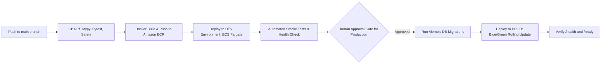

# Deployment & Release Strategy

**Document Version**: 1.0.0 (Phase 0 Freeze)  
**Target Infrastructure**: AWS ECS Fargate / AWS App Runner & Amazon S3 / CloudFront  

---

## 1. Multi-Stage Deployment Pipeline

The deployment pipeline automates the progression of artifacts from code commit to production using GitHub Actions and AWS ECR:

---

## 2. Containerized Service Deployment Details

### Backend API Service
* **Container Runtime**: Docker on AWS ECS Fargate (`ap-south-1`).
* **Base Image**: `python:3.12-slim-bookworm`.
* **Execution User**: Non-root `appuser` (UID: `10001`).
* **Resource Allocation**:
  * Dev: 0.5 vCPU, 1 GB RAM.
  * Production: 1.0 vCPU, 2 GB RAM (Autoscaling: 2 to 6 tasks based on CPU/Request count).
* **Database Migrations**: Executed as an isolated, short-lived ECS Task (`alembic upgrade head`) before traffic is routed to new container tasks.
* **Rolling Updates**: ECS rolling deployment with minimum 100% healthy tasks and maximum 200% capacity during transitions.

### Frontend Web Service
* **Hosting**: Next.js static / SSR export hosted on AWS App Runner or AWS Amplify / S3 + CloudFront CDN.
* **SSL/TLS**: Managed ACM certificates with TLS 1.3 enforced.

---

## 3. Rollback Protocol
1. **Automated Rollback Trigger**: If container health checks (`/api/v1/health` and `/api/v1/ready`) fail for 3 consecutive intervals (90 seconds) post-deployment, ECS automatically cancels the deployment and routes traffic back to the prior stable task definition.
2. **Database Rollback Strategy**: All database migrations must be written to be backward-compatible (expand-and-contract pattern). Destructive column deletions are deferred until the subsequent release cycle.
