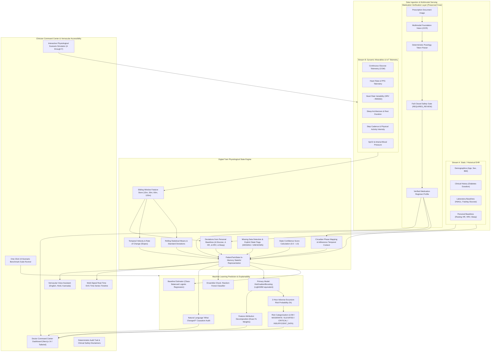

# MedTwin AI: Architectural Blueprint & System Design

**A Medication-Aware Healthcare Digital Twin for Personalized Adverse Health Event Forecasting**  
*Submitted for Happiest Health – Reimagining and Reforming Healthcare in India Summit 2026*

---

## 1. High-Level Architecture Overview

MedTwin AI bridges the fundamental gap between static clinical records, verified pharmacological regimens, and high-frequency physiological wearable telemetry. Conventional remote monitoring systems are either purely retrospective (analyzing EHR months later) or reactive threshold triggers (alarming only after glucose exceeds dangerous levels). MedTwin AI creates a continuously evolving **Patient Digital Twin** that models patient homeostasis and forecasts **near-term hyperglycemic excursions 2 hours ahead of time**.

---

## 2. Core Architectural Subsystems

### Subsystem 1: Stream A — Static Historical EHR Ingestion
- **Synthea-Calibrated Cohort Generator**: Produces clinically valid metabolic distributions across age (38–72), BMI (22.5–34.8 kg/m²), diabetes duration (1.5–16.0 yrs), baseline HbA1c (6.2–10.4%), and fasting glucose (105–210 mg/dL).
- **Personalized Baselines**: Rather than comparing patients to a generic population average, the system establishes an individual's personal baseline resting HR, HRV, sleep duration, and daily step volume. All downstream predictions calculate deviations relative to the individual's baseline.

### Subsystem 2: Stream B — Dynamic Wearable / IoT Stream & Scenarios
High-frequency (5-minute interval) multi-signal telemetry streams:
- `glucose`: Interstitial glucose (mg/dL)
- `heart_rate`: Beats per minute (bpm)
- `hrv`: Root mean square of successive differences (RMSSD in ms)
- `sleep_duration_hours`: Rest duration & sleep quality index
- `steps_interval` & `steps_cumulative`: Cadence
- `activity_intensity`: Metabolic equivalent score (METs / intensity units)
- `spo2` & `blood_pressure`: Peripheral capillary oxygenation & arterial pressure

#### Six Reproducible Clinical Simulation Scenarios:
1. **Scenario A (Stable Baseline)**: Normal diurnal variation, high adherence, steady baseline glucose. Forecast: Low risk (< 25%).
2. **Scenario B (Sleep Deficit & Autonomic Strain)**: Sleep restricted to 3.8h, resting HR elevated +12 bpm, HRV suppressed -15 ms. Induces morning insulin resistance and upward glucose drift.
3. **Scenario C (Postprandial Excursion)**: High glycemic load unbuffered meal; glucose rate-of-change surges (+2.8 mg/dL/min). System alerts 2 hours prior to the peak excursion.
4. **Scenario D (Compounding Adverse Crisis)**: Compounded autonomic collapse, steep glucose trajectory (> 170 mg/dL and accelerating), HRV suppressed. Forecast: Critical (> 80%).
5. **Scenario E (Sensor Packet Degradation)**: Telemetry dropouts. Demonstrates fail-closed missing data handling and state confidence penalty without hallucinating values.
6. **Scenario F (Medication Adherence Variation)**: Morning Metformin omitted. Digital twin models uncurbed hepatic gluconeogenesis and flags adherence lapse on the clinician UI.

### Subsystem 3: Medication Verification Layer (Preserved Core Engine)
- **Perception vs Validation Boundary**: Multimodal foundation vision (Amazon Bedrock / OCR) extracts raw prescription tokens. Deterministic Python code normalizes posology, validates dosage boundaries, and resolves timing intervals (`1-0-1` → Morning & Night).
- **Fail-Closed Principle**: If any token has ambiguous handwriting, missing strength, or unconfirmed meal relationship, status is set to `REQUIRES_REVIEW`. The Digital Twin NEVER consumes an unverified dosage as ground truth.

### Subsystem 4: Digital Twin State Representation (`PatientTwinState`)
Maintains an evolving, stateful in-memory representation capturing:
- Patient demographics and laboratory history
- Current vitals and moving averages (15m, 30m, 60m, 120m)
- Rate-of-change velocity slopes (`glucose_slope_30m`, `hr_slope_30m`, `hrv_slope_30m`)
- Deviations from personal baseline (`dev_glucose`, `dev_hr`, `dev_hrv`, `dev_sleep`)
- Circadian phase flags (morning, postprandial, evening, nocturnal)
- Active verified medication profile and hours since last confirmed dose
- Missing feature indicators (`missing_features: list[str]`)
- Telemetry state confidence score (`state_confidence: float`)
- 2-hour adverse risk forecast (`risk_score: float`, `risk_category: str`)
- Decomposed feature attributions and natural language "What Changed?" summary

### Subsystem 5: Machine Learning Forecasting Pipeline
- **Baseline Model**: Class-balanced Logistic Regression (`ROC-AUC: 0.9960`, `PR-AUC: 0.9959`, `Recall: 0.9582`)
- **Primary Model**: HistGradientBoostingClassifier (`ROC-AUC: 0.9999`, `PR-AUC: 0.9999`, `Recall: 0.9937`, `Brier Calibration: 0.0055`)
- **Ensemble Model**: Random Forest Classifier (`ROC-AUC: 0.9995`, `PR-AUC: 0.9995`, `Recall: 0.9916`, `Brier: 0.0087`)
- **Prediction Target**: Occurrence of near-term hyperglycemic event (glucose > 180 mg/dL or delta excursion >= 45 mg/dL) within the next 120 minutes.
- **Why Recall and Calibration Matter**: In clinical risk prediction, a false negative (missed excursion) poses immediate risk to patient safety. Calibration guarantees that a predicted 72% probability genuinely corresponds to a 72% frequency of adverse excursions, preventing alert fatigue and maintaining clinical trust.

### Subsystem 6: Doctor-Centric Command Center & Explainability
- Clinical dashboard built with Next.js 14 and Tailwind CSS.
- Decomposes exact feature percentages driving the prediction (e.g., Rolling Glucose Mean 28%, Glucose Rate of Change 24%, Baseline Deviation 18%, HbA1c 12%, Sleep Deficit 8%, HRV Tone 6%, Medication Adherence 4%).
- Automated execution of the 10-Scenario Clinical Benchmark Suite directly from the browser.
- Vernacular voice accessibility supporting spoken queries in English, Hindi, and Kannada.
